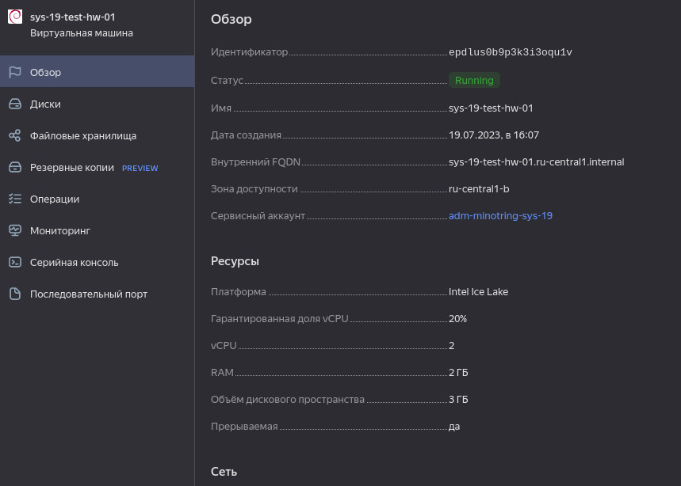

# Домашнее задание к занятию "Обзор систем ИТ-мониторинга" - `Ромашкова Алина`

### Задание 1

`Создайте виртуальную машину в Yandex Compute Cloud и с помощью Yandex Monitoring создайте дашборд, на котором будет видно загрузку процессора.`

`При необходимости прикрепитe сюда скриншоты

